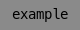
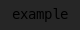
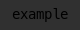

Chroma color themes
===================

various color themes derived from my vim theme (also linked in here).

# Base colors for all themes

| Color name  | RGB-Hex | Term | Foreground preview         | Background preview                                                    |
|-------------|---------|------|----------------------------|-----------------------------------------------------------------------|
| blue        | #00afff |   39 |  |  |
| lightblue   | #87afff |  111 |  |  |
| orange      | #ffaf5f |  215 |  |  |
| yellow      | #ffd75f |  221 |  |  |
| green       | #87d75f |  113 |  |  |
| red         | #ff0000 |  196 |  |  |
| lightred    | #ff5f5f |  203 |  |  |
| white       | #ffffff |  255 |  |  |
| lightgray   | #c6c6c6 |  251 |  |  |
| gray        | #8a8a8a |  244 |  |  |
| bggray      | #1c1c1c |  234 |  |  |
| lightbggray | #262626 |  235 |  |  |
| visualgray  | #303030 |  236 |  |  |
| black       | #000000 |    0 |  |  |

# Usage

## dmenu / urxvt

copy the lines from the `Xresources` file in the corresponding folder to your
own `.Xresources` or `.Xdefaults`

## intellij

Import via "Editor > Color Scheme > little gear icon > Import Scheme"

## (neo)mutt

Put the file somewhere and add `source <path to theme file>` in your muttrc or
neomuttrc

## (neo)vim

Copy `chroma.vim` to your `colors` dir or use your favorite plugin manager. The
vim theme is in a separate repo, so most plugin managers can clone that directly

## qutebrowser (>= 1.1.0)

Add `config.source('chroma.py')` to your `config.py`

## tmux

Add the lines from the file to your `tmux.conf`

The tmux theme includes different formatting for the status line. If you don't
want that, the comment at the top contains all color codes used.

## weechat

Add the lines to `weechat.conf`, replacing any existing `[palette]` or `[color]`
sections.
